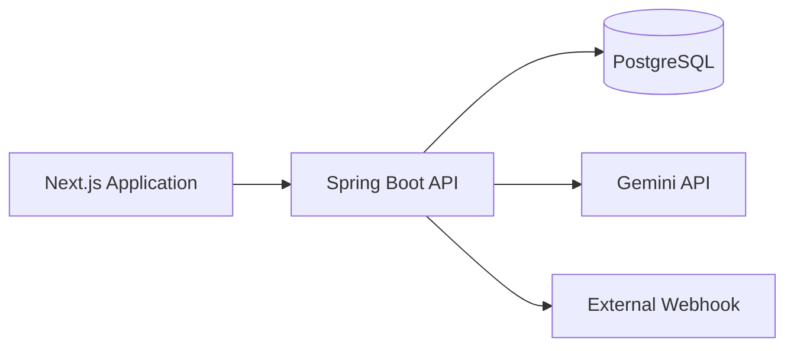

# SYSTEM ARCHITECTURE
# RoboClean Landing Page

Version: 1.0

---

# 1. Architecture Overview

RoboClean sử dụng kiến trúc Client–Server.

Frontend và Backend được triển khai độc lập.

```
Browser
        │
        ▼
Next.js
        │
 REST API
        │
        ▼
Spring Boot
        │
        ▼
PostgreSQL

        │
        ├────────► Gemini API
        │
        └────────► Webhook
```

Kiến trúc được thiết kế nhằm:

- tối ưu SEO;
- giảm thời gian tải trang;
- dễ mở rộng;
- dễ triển khai.

---

# 2. High Level Architecture



---

# 3. Component Responsibilities

## Frontend

Responsibilities

- Render Landing Page
- Handle UI interaction
- Client-side validation
- Local persistence
- Animation
- Theme management

Technologies

- Next.js
- Tailwind
- Zustand
- Framer Motion

---

## Backend

Responsibilities

- Business Logic
- REST API
- Validation
- AI Integration
- Webhook Integration
- Database Access

Technologies

- Spring Boot
- Spring Data JPA
- Bean Validation

---

## Database

Responsibilities

Persist

- Products
- Reviews
- FAQ
- Subscribers
- Chat History
- Tracking Events

---

## External Services

Gemini

- AI Chatbot

Webhook

- Tracking
- Newsletter
- Automation

---

# 4. Frontend Architecture

```
App Router

↓

Layout

↓

Sections

↓

Reusable Components

↓

Hooks

↓

Stores

↓

Services
```

Folder

```
app/

components/

hooks/

services/

store/

utils/

types/
```

---

# 5. Backend Architecture

```
Controller

↓

Service

↓

Repository

↓

Database
```

Folder

```
controller/

service/

repository/

entity/

dto/

config/

exception/
```

---

# 6. Data Flow

## Newsletter

```
User

↓

Form

↓

Zod Validation

↓

POST /subscribers

↓

Spring Validation

↓

Database

↓

Webhook

↓

Response
```

---

## Chatbot

```
User

↓

Chat Widget

↓

POST /chat

↓

Prompt Builder

↓

Gemini

↓

Response

↓

Frontend
```

---

## Tracking

```
Click

↓

Tracking Hook

↓

POST /tracking

↓

Database

↓

Webhook
```

---

# 7. State Management

## Client State

Persist

- Cart
- Wishlist
- Recently Viewed
- Theme

Library

Zustand

---

## Server State

Fetched

- Products
- Reviews
- FAQ

Strategy

Server Components

---

# 8. Rendering Strategy

Static

- Hero
- Features
- FAQ
- Footer

Server Components

- Products

Client Components

- Cart
- Wishlist
- Chatbot
- Theme Switcher

---

# 9. Security

API Keys

Backend only.

Validation

Frontend

Zod

Backend

Bean Validation

Secrets

Environment Variables only.

---

# 10. Performance Strategy

Frontend

- Static Rendering
- next/image
- Lazy Loading
- Code Splitting

Backend

- JPA
- Connection Pool
- Efficient Queries

---

# 11. Deployment Architecture

```
GitHub

↓

Vercel

↓

Next.js

↓

Spring Boot

↓

Render

↓

PostgreSQL

↓

Neon
```

---

# 12. Architectural Decisions

ADR-001

Use Next.js App Router.

Reason

SEO & Performance.

---

ADR-002

Use Spring Boot.

Reason

Strong REST API support.

---

ADR-003

Use Zustand.

Reason

Lightweight global state.

---

ADR-004

Use PostgreSQL.

Reason

Reliable relational database.

---

ADR-005

Store Cart in LocalStorage.

Reason

Landing Page does not require authentication.

---

ADR-006

AI requests always go through Backend.

Reason

Protect API Keys.

---

# 13. Architecture Principles

✓ Separation of Concerns

✓ Single Responsibility

✓ RESTful API

✓ Stateless Backend

✓ Mobile First

✓ Component Reusability

✓ Security by Default

✓ Performance First