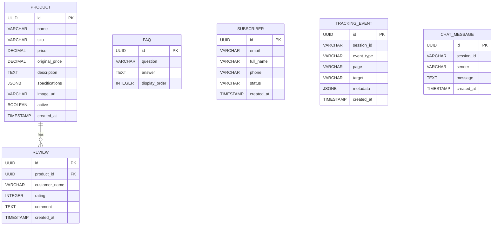

# DATA MODEL
# RoboClean Landing Page

Version: 1.0

---

# 1. Overview

Hệ thống sử dụng PostgreSQL làm cơ sở dữ liệu chính.

Dữ liệu được chia thành 2 nhóm:

## Business Data

- Product
- Subscriber
- FAQ
- Review

## System Data

- Tracking Event
- Chat Message

---

# 2. Design Principles

- UUID làm Primary Key.
- Snake_case cho tên bảng và cột.
- Soft Delete không áp dụng.
- Timestamp sử dụng UTC.
- Mỗi bảng đều có trường created_at.
- Chỉ lưu dữ liệu thật sự cần thiết.

---

# 3. Entity Relationship

---

# 4. Entity Definitions

## Product

Lưu thông tin robot hút bụi và phụ kiện.

| Column | Type | Constraint |
|---------|------|------------|
| id | UUID | PK |
| name | VARCHAR(255) | NOT NULL |
| sku | VARCHAR(100) | UNIQUE |
| price | DECIMAL(12,2) | NOT NULL |
| original_price | DECIMAL(12,2) | NULL |
| description | TEXT | NULL |
| specifications | JSONB | NULL |
| image_url | VARCHAR(500) | NULL |
| active | BOOLEAN | DEFAULT TRUE |
| created_at | TIMESTAMP | DEFAULT CURRENT_TIMESTAMP |

---

## Review

Đánh giá của khách hàng.

| Column | Type |
|---------|------|
| id | UUID |
| product_id | UUID |
| customer_name | VARCHAR |
| rating | INTEGER |
| comment | TEXT |
| created_at | TIMESTAMP |

Rules

- Rating từ 1 → 5.
- Một Review thuộc một Product.

---

## FAQ

Danh sách câu hỏi thường gặp.

| Column | Type |
|---------|------|
| id | UUID |
| question | VARCHAR |
| answer | TEXT |
| display_order | INTEGER |

---

## Subscriber

Thông tin người đăng ký nhận tin.

| Column | Type |
|---------|------|
| id | UUID |
| email | VARCHAR |
| full_name | VARCHAR |
| phone | VARCHAR |
| status | VARCHAR |
| created_at | TIMESTAMP |

Status

- ACTIVE
- UNSUBSCRIBED

---

## Tracking Event

Theo dõi hành vi người dùng.

| Column | Type |
|---------|------|
| id | UUID |
| session_id | VARCHAR |
| event_type | VARCHAR |
| page | VARCHAR |
| target | VARCHAR |
| metadata | JSONB |
| created_at | TIMESTAMP |

Supported Events

- CLICK
- SCROLL
- VIEW_PRODUCT
- ADD_TO_CART
- ADD_TO_WISHLIST
- CHAT_OPEN

---

## Chat Message

Lưu lịch sử chatbot.

| Column | Type |
|---------|------|
| id | UUID |
| session_id | VARCHAR |
| sender | VARCHAR |
| message | TEXT |
| created_at | TIMESTAMP |

Sender

- USER
- BOT

---

# 5. Indexes

Subscriber

- UNIQUE(email)

Product

- UNIQUE(sku)

Tracking Event

- INDEX(session_id)
- INDEX(created_at)

Chat Message

- INDEX(session_id)

Review

- INDEX(product_id)

---

# 6. Database Conventions

Primary Key

UUID

Naming

snake_case

Timestamp

UTC

Boolean

true / false

Text

UTF-8

---

# 7. Persistence Strategy

Persist in Database

- Products
- Reviews
- FAQ
- Subscribers
- Tracking Events
- Chat Messages

Persist in Local Storage

- Cart
- Wishlist
- Recently Viewed

Reason

Theo yêu cầu của Landing Page, các dữ liệu mang tính cá nhân tạm thời sẽ được lưu phía Client bằng Zustand Persist thay vì Database nhằm giảm số lượng API và tăng tốc độ phản hồi.