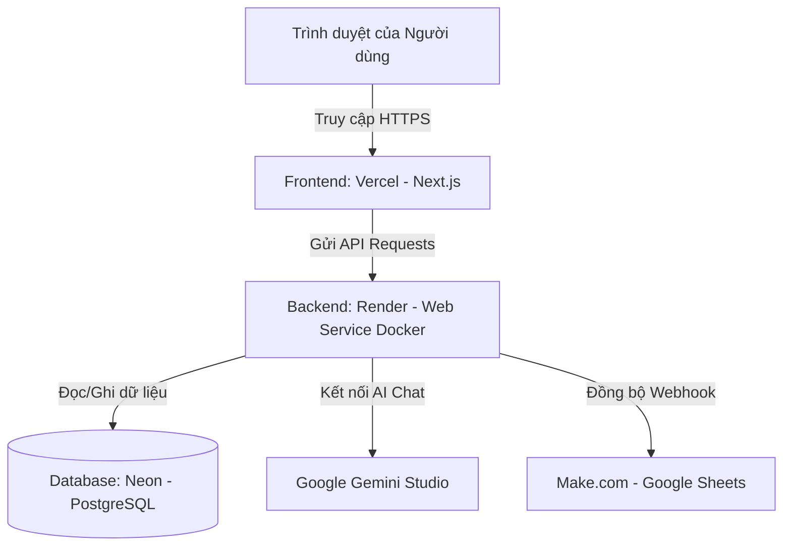

# HƯỚNG DẪN TRIỂN KHAI DỰ ÁN LÊN RENDER & VERCEL

Tài liệu này hướng dẫn chi tiết các bước để cấu hình và triển khai hệ thống **RoboClean** của bạn lên môi trường Internet thực tế:
- **Backend (Spring Boot + Java 17 + PostgreSQL)**: Deploy lên **Render** thông qua Dockerfile.
- **Database (PostgreSQL Cloud)**: Đăng ký miễn phí trên **Neon.tech**.
- **Frontend (Next.js)**: Deploy lên **Vercel**.

---

## 🗺️ Sơ Đồ Kiến Trúc Deploy

---

## 📦 Các Bước Chuẩn Bị Trước Khi Deploy

1. **Đưa toàn bộ dự án lên GitHub:**
   - Đảm bảo toàn bộ mã nguồn cục bộ đã được commit và push lên repository của bạn tại: `https://github.com/thai2602/RoboClean`.
2. **Đăng ký tài khoản các nền tảng miễn phí:**
   - [Render](https://render.com) (Liên kết trực tiếp với tài khoản GitHub).
   - [Vercel](https://vercel.com) (Liên kết trực tiếp với tài khoản GitHub).
   - [Neon.tech](https://neon.tech) (PostgreSQL Database đám mây).

---

## 📑 BƯỚC 1: Triển Khai PostgreSQL Trên Neon.tech

Spring Boot cần kết nối với database PostgreSQL ở môi trường Production thay vì H2 Database tạm thời ở RAM.

1. Truy cập [Neon.tech](https://neon.tech) và đăng ký tài khoản miễn phí.
2. Tạo một Project mới (đặt tên ví dụ: `roboclean-db`).
3. Chọn vùng máy chủ (**Region**) gần bạn nhất (khuyên dùng **Singapore / Asia Pacific**) để tối ưu độ trễ.
4. Sau khi khởi tạo xong, hệ thống sẽ cấp một chuỗi kết nối **Connection String** tại tab **Dashboard** dạng:
   `postgresql://[username]:[password]@[host]/[dbname]?sslmode=require`
5. Hãy copy chuỗi này lại để cấu hình cho Backend ở bước sau.

---

## ☕ BƯỚC 2: Triển Khai Backend Spring Boot Trên Render

Để đảm bảo không bị lỗi sai phiên bản Java trên Render, chúng ta sử dụng **Docker** thông qua tệp [backend/Dockerfile](file:///c:/WorkSpace/Web/RoboClean/backend/Dockerfile) đã được tối ưu hóa đa tầng (multi-stage) để đóng gói ứng dụng siêu nhẹ.

### 2.1 Cấu hình profile môi trường Production
Chúng ta đã cấu hình tệp [application-prod.properties](file:///c:/WorkSpace/Web/RoboClean/backend/src/main/resources/application-prod.properties) để tự động nhận dạng Driver PostgreSQL. Bạn chỉ cần nạp các biến môi trường tương ứng khi thiết lập Web Service trên Render.

### 2.2 Tạo Web Service trên Render
1. Truy cập **Render Dashboard**, nhấn **New > Web Service**.
2. Chọn **Build and deploy from a Git repository**, nhấn **Next**.
3. Chọn repository chứa dự án của bạn (`RoboClean`).
4. Cấu hình các thông số sau:
   * **Name:** `roboclean-backend`
   * **Region:** Chọn khu vực máy chủ trùng với Database Neon (ví dụ: `Singapore`).
   * **Branch:** `main` (hoặc nhánh chính chứa code của bạn).
   * **Root Directory:** **`backend`** *(Rất quan trọng! Để Render biết đây là thư mục chứa Spring Boot).*
   * **Runtime:** Chọn **`Docker`** *(Render sẽ tự động đọc tệp `Dockerfile` nằm trong thư mục `backend` để tự động tải JDK 17, build Maven và chạy ứng dụng).*
   * **Instance Type:** Chọn **`Free`**.

### 2.3 Cấu hình Biến Môi Trường (Environment Variables)
Nhấp vào nút **Advanced** (hoặc chuyển sang tab **Environment**) trên Render và thêm đầy đủ các biến môi trường sau để cấu hình chạy thực tế:

| Tên biến (Key) | Giá trị gợi ý (Value) | Giải thích |
| :--- | :--- | :--- |
| `SPRING_PROFILES_ACTIVE` | `prod` | Kích hoạt cấu hình sản xuất PostgreSQL |
| `SPRING_DATASOURCE_URL` | `jdbc:postgresql://[host-tu-neon]/[dbname]?sslmode=require` | Chuỗi kết nối Neon của bạn ở Bước 1. **(Lưu ý: Phải đổi tiền tố `postgresql://` thành `jdbc:postgresql://`)** |
| `SPRING_DATASOURCE_USERNAME` | `[username-db-neon]` | Username PostgreSQL cấp bởi Neon |
| `SPRING_DATASOURCE_PASSWORD` | `[password-db-neon]` | Password PostgreSQL cấp bởi Neon |
| `GEMINI_API_KEY` | `AIzaSy...` | API Key của Google Gemini AI Studio để chạy Chatbot |
| `CORS_ALLOWED_ORIGINS` | `https://roboclean.vercel.app` | Điền link domain Frontend Vercel của bạn (sẽ có ở Bước 3) |
| `TRACKING_WEBHOOK_URL` | `https://hook.eu1.make.com/xxxxxx` | Đường dẫn Make Webhook (hoặc Google Apps Script) ghi Google Sheets |

5. Nhấn **Create Web Service**.
6. Quá trình tải Docker image và biên dịch mã nguồn Java lần đầu sẽ mất khoảng 4-6 phút. Khi chạy thành công, Render sẽ hiển thị trạng thái **Live** kèm đường dẫn URL dạng: `https://roboclean-backend.onrender.com`.

---

## 💻 BƯỚC 3: Triển Khai Frontend Next.js Trên Vercel

Vercel là nền tảng tối ưu nhất để vận hành Next.js, hỗ trợ tự động nhận dạng cấu hình Monorepo.

1. Truy cập **Vercel Dashboard**, nhấn **Add New... > Project**.
2. Chọn repository dự án `RoboClean` từ tài khoản GitHub.
3. Thiết lập thông số dự án:
   * **Project Name:** `roboclean`
   * **Framework Preset:** Chọn **`Next.js`**.
   * **Root Directory:** Nhấp vào *Edit* và chọn thư mục **`frontend`** *(Rất quan trọng! Để Vercel chỉ build mã nguồn Next.js ở thư mục này).*
   * **Build and Output Settings:** Giữ nguyên mặc định.
4. **Cấu hình biến môi trường (Environment Variables):**
   Mở rộng phần cấu hình biến môi trường và thêm biến sau:
   * **Key**: `NEXT_PUBLIC_API_URL`
   * **Value**: Điền URL backend Render của bạn (đã tạo ở Bước 2) kèm hậu tố `/api/v1` (ví dụ: `https://roboclean-backend.onrender.com/api/v1`).
5. Bấm nút **Deploy**.
6. Vercel sẽ tự động build code Next.js trong vòng 1-2 phút và cấp cho bạn đường dẫn URL dạng `https://roboclean.vercel.app` (hoặc tên miền ngẫu nhiên do Vercel cấp). 

---

## 🧪 BƯỚC 4: Kiểm Tra Sau Triển Khai
1. Copy tên miền của Vercel (Frontend) vừa tạo ở Bước 3, vào cấu hình **Environment Variables của Render Backend** cập nhật vào biến `CORS_ALLOWED_ORIGINS` để backend cho phép frontend gọi API mà không bị chặn CORS.
2. Mở trình duyệt truy cập domain Vercel của bạn, mở F12 Console kiểm tra xem dữ liệu Sản phẩm, FAQ, Chatbot AI và Webhook có hoạt động trơn tru không.
3. Dự án hỗ trợ **CI/CD tự động**, từ nay mỗi khi bạn gõ `git push` code mới lên GitHub, cả Vercel và Render sẽ tự động build lại và cập nhật phiên bản mới nhất ngay lập tức!

