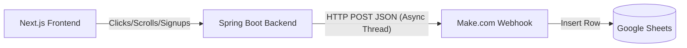

# HƯỚNG DẪN KẾT NỐI WEBHOOK VỚI GOOGLE SHEETS QUA MAKE.COM

Hệ thống Spring Boot Backend của RoboClean đã được tích hợp sẵn cơ chế **Tự động gọi Webhook bất đồng bộ (Async Webhook Dispatcher)** khi có sự kiện phát sinh:
1. Khi có khách hàng đăng ký nhận tin (form Newsletter).
2. Khi khách hàng tương tác trên trang (click nút bấm, cuộn trang).

Tài liệu này hướng dẫn bạn từng bước kết nối webhook đó sang Google Sheets thông qua nền tảng tự động hóa miễn phí **Make.com** (hoặc Zapier) để lưu danh sách khách hàng và logs tương tác tự động.

---

## 1. Luồng hoạt động (Data Flow)



---

## 2. Các bước thiết lập trên Make.com & Google Sheets

### Bước 2.1: Tạo file Google Sheets
1. Tạo một trang tính mới trên Google Drive của bạn (ví dụ đặt tên là: `RoboClean_Tracking_Leads`).
2. Tạo 2 sheet con bên trong:
   * **Sheet 1 (`Subscribers`):** Đặt tên các cột ở hàng đầu tiên:
     `ID` | `Email` | `Họ Tên` | `Số Điện Thoại` | `Thời Gian`
   * **Sheet 2 (`Tracking_Logs`):** Đặt tên các cột ở hàng đầu tiên:
     `ID` | `Session ID` | `Loại Tương Tác` | `Trang` | `Đối Tượng (Target)` | `Thời Gian`

### Bước 2.2: Tạo Scenario trên Make.com
1. Đăng ký tài khoản miễn phí trên [Make.com](https://www.make.com).
2. Nhấn nút **Create a new scenario** ở góc phải màn hình.
3. Nhấp vào vòng tròn lớn ở giữa màn hình, tìm kiếm ứng dụng **Webhooks** và chọn trigger: **Custom Webhook**.
4. Nhấn **Create a Webhook**, đặt tên (ví dụ: `RoboClean_Receiver`) rồi nhấn **Save**.
5. Make.com sẽ cấp cho bạn một đường dẫn URL duy nhất dạng:
   `https://hook.us1.make.com/xxxxxxxxxxxxxxxxxxxxxxxx`
6. Nhấp chuột phải vào URL đó để copy vào bộ nhớ tạm.

---

## 3. Cấu hình biến môi trường trên Backend

1. Mở file `.env` tại thư mục `backend/` trên máy của bạn (nếu chưa có, hãy copy từ file [backend/.env.example](file:///c:/WorkSpace/Web/RoboClean/backend/.env.example)).
2. Dán địa chỉ URL của Make.com vào biến môi trường `TRACKING_WEBHOOK_URL`:
   ```env
   TRACKING_WEBHOOK_URL=https://hook.us1.make.com/xxxxxxxxxxxxxxxxxxxxxxxx
   ```
3. Restart lại server Spring Boot backend để nhận cấu hình mới:
   ```bash
   .\mvnw.cmd spring-boot:run
   ```

---

## 4. Xác định cấu trúc dữ liệu gửi đi (Data Payload)

Khi Backend hoạt động, nó sẽ tự động bắn dữ liệu JSON sang Make.com với cấu trúc sau:

### Dữ liệu Đăng ký nhận tin (`SUBSCRIBE` event):
```json
{
  "eventType": "SUBSCRIBE",
  "subscriberId": "48b3b7f1-...",
  "fullName": "Nguyen Van A",
  "email": "vana@example.com",
  "phone": "0987654321",
  "timestamp": "2026-06-30T09:00:00"
}
```

### Dữ liệu Telemetry click/cuộn trang (`TRACKING` event):
```json
{
  "eventType": "TRACKING",
  "eventId": "f1b88e10-...",
  "sessionId": "sess_abc123",
  "trackingType": "CLICK", // Hoặc SCROLL
  "page": "/",
  "target": "btn-mua-ngay", // Hoặc scroll-depth-50%
  "metadata": {
    "userAgent": "Mozilla/5.0...",
    "screenWidth": 1920,
    "screenHeight": 1080
  },
  "timestamp": "2026-06-30T09:01:15"
}
```

---

## 5. Map dữ liệu sang Google Sheets trên Make.com

1. Quay lại màn hình Make.com, lúc này hệ thống đang ở trạng thái chờ gói tin gửi đến (**Redetect status**).
2. Hãy mở website lên, thử thực hiện đăng ký nhận tin hoặc bấm một nút bất kỳ. Backend của bạn sẽ gửi một yêu cầu thử nghiệm sang Make.com. Khi nhận được, Make sẽ hiện thông báo thành công: *Successfully determined*.
3. Bấm vào biểu tượng **Add another module** tiếp theo trong luồng (bên phải Webhooks module).
4. Tìm kiếm **Google Sheets** và chọn action: **Add a Row**.
5. Kết nối tài khoản Google Drive của bạn và chọn tệp trang tính `RoboClean_Tracking_Leads`.
6. Sử dụng cấu hình bộ lọc rẽ nhánh (Router) trên Make để đẩy đúng sheet:
   * Nếu `eventType` là `SUBSCRIBE` -> Ghi vào Sheet `Subscribers`. Map trường:
     * *Email* = `email` từ webhook
     * *Họ Tên* = `fullName`
     * *Số Điện Thoại* = `phone`
     * *Thời Gian* = `timestamp`
   * Nếu `eventType` là `TRACKING` -> Ghi vào Sheet `Tracking_Logs`. Map trường:
     * *Session ID* = `sessionId`
     * *Loại Tương Tác* = `trackingType`
     * *Trang* = `page`
     * *Đối Tượng (Target)* = `target`
     * *Thời Gian* = `timestamp`
7. Lưu Scenario và bật nút kích hoạt ở góc dưới bên trái: **Scheduling ON**.

---

## 6. Cách 2: Sử dụng Google Apps Script (Không cần qua Make.com - Khuyên dùng)

Cách này cho phép Spring Boot Backend bắn dữ liệu thẳng tới Google Sheets thông qua một đoạn mã Google Apps Script nhỏ (Web App) được tích hợp ngay bên trong file Google Sheets của bạn. Cách này miễn phí 100%, không bị giới hạn lượt chạy (limit) như Make.com.

### Bước 6.1: Sao chép mã Google Apps Script dưới đây
```javascript
function doPost(e) {
  try {
    // Phân tích cú pháp dữ liệu JSON nhận được từ Backend
    var jsonString = e.postData.contents;
    var data = JSON.parse(jsonString);
    
    // Mở trang tính hiện tại
    var ss = SpreadsheetApp.getActiveSpreadsheet();
    var eventType = data.eventType;
    
    if (eventType === "SUBSCRIBE") {
      var sheet = ss.getSheetByName("Subscribers");
      if (!sheet) {
        sheet = ss.insertSheet("Subscribers");
        sheet.appendRow(["ID", "Email", "Họ Tên", "Số Điện Thoại", "Thời Gian"]);
      }
      sheet.appendRow([
        data.subscriberId,
        data.email,
        data.fullName,
        data.phone || "",
        data.timestamp
      ]);
    } else if (eventType === "TRACKING") {
      var sheet = ss.getSheetByName("Tracking_Logs");
      if (!sheet) {
        sheet = ss.insertSheet("Tracking_Logs");
        sheet.appendRow(["ID", "Session ID", "Loại Tương Tác", "Trang", "Đối Tượng (Target)", "Thời Gian"]);
      }
      sheet.appendRow([
        data.eventId || "",
        data.sessionId,
        data.trackingType,
        data.page,
        data.target || "",
        data.timestamp
      ]);
    }
    
    return ContentService.createTextOutput(JSON.stringify({
      "success": true,
      "message": "Recorded successfully in Google Sheets"
    })).setMimeType(ContentService.MimeType.JSON);
    
  } catch(error) {
    return ContentService.createTextOutput(JSON.stringify({
      "success": false,
      "error": error.toString()
    })).setMimeType(ContentService.MimeType.JSON);
  }
}
```

### Bước 6.2: Dán mã và Triển khai (Deploy)
1. Tại file Google Sheets của bạn, chọn **Tiện ích mở rộng (Extensions) > Apps Script**.
2. Xóa toàn bộ code mặc định trong trình soạn thảo, dán đoạn mã bên trên vào rồi ấn **Lưu (Save)**.
3. Bấm vào nút **Triển khai (Deploy) > Triển khai mới (New deployment)** ở góc trên bên phải.
4. Chọn loại cấu hình là **Ứng dụng web (Web app)** (bằng cách nhấp vào biểu tượng bánh răng).
5. Thiết lập các thông số sau:
   * **Mô tả (Description):** `RoboClean Webhook Receiver`
   * **Thực thi dưới danh nghĩa (Execute as):** `Tôi (Email của bạn)`
   * **Ai có quyền truy cập (Who has access):** `Bất kỳ ai (Anyone)` *(Mục này cực kỳ quan trọng để backend có thể gửi dữ liệu ẩn danh)*.
6. Bấm nút **Triển khai (Deploy)**. Google sẽ yêu cầu bạn cấp quyền truy cập tài liệu, hãy bấm *Cấp quyền (Authorize)* và làm theo hướng dẫn.
7. Khi triển khai xong, copy đường dẫn **URL ứng dụng web** (đầu link có dạng `https://script.google.com/macros/s/.../exec`).

### Bước 6.3: Cấu hình URL vào file `.env` ở Backend
1. Mở file `.env` tại thư mục `backend/` và dán URL vừa copy vào:
   ```env
   TRACKING_WEBHOOK_URL=https://script.google.com/macros/s/HO_HO_HO_X_X_X/exec
   ```
2. Khởi động lại Server Backend để nhận cấu hình mới. Từ giờ trở đi, mọi logs và lead khách hàng sẽ được đẩy thẳng trực tiếp vào Google Sheets mà không cần qua trung gian Make.com!

